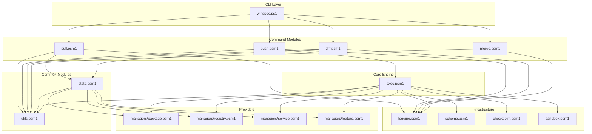

# WinSpec Redesign: Git-like State Manipulation

## Overview

This document proposes a refactoring of WinSpec's state manipulation commands and the core module architecture. The key principle is **no wrapper commands** and **clear separation of concerns** between modules.

---

## Current State Analysis

### Current Module Responsibilities

| Module | Current Responsibilities |
|--------|------------------------|
| **utils.psm1** | Value formatting, hashtable ops, config file ops, path resolution |
| **state.psm1** | Provider resolution, state capture, comparison |
| **core.psm1** | Spec import, provider execution, trigger execution, path resolution (DUPLICATE!) |

### Overlaps Identified

1. **Path Resolution:**
   - `utils.psm1`: `Resolve-ConfigPath`, `Resolve-SpecPath`
   - `core.psm1`: `Resolve-ConfigLocation`, `Resolve-SpecPath` (DUPLICATE!)

2. **Config Operations:**
   - `utils.psm1`: `Import-Configuration`, `Save-Configuration`
   - `core.psm1`: `Import-Spec` (wrapper), `Resolve-Spec` (processes imports)

3. **Function Duplicates:**
   - `Merge-Hashtables` exists in both utils.psm1 AND is exported from core.psm1
   - Path resolution functions are scattered across modules

---

## Proposed Module Architecture

### Clear Separation of Concerns

```
winspec/
├── logging.psm1       # Logging utilities
├── schema.psm1        # Schema validation
├── checkpoint.psm1    # System restore points
├── sandbox.psm1       # Sandbox execution
│
├── utils.psm1         # Shared utilities (NO overlapping with others)
├── state.psm1         # State operations (NO overlapping with others)
├── exec.psm1         # Execution engine (focused, NO duplicates)
│
├── pull.psm1         # NEW: pull command
├── push.psm1         # NEW: push command
├── diff.psm1         # REFACTORED: diff command
└── merge.psm1        # REFACTORED: merge command
```

### Module Boundaries

#### utils.psm1 - Utility Functions
```
Responsibilities:
- Value formatting and display
- Hashtable operations (copy, merge, add, remove)
- Config file I/O (import, save)
- Path resolution (config path, spec path)

Functions:
- ConvertTo-DisplayValue
- ConvertTo-DetailedDisplayValue
- ConvertTo-HashtableString
- ConvertTo-PowerShellValue
- Copy-Hashtable
- Merge-Hashtables
- Add-ToConfigPath
- Remove-FromConfigPath
- Test-ValuesEqual
- Import-Configuration / Import-Spec (alias)
- Save-Configuration
- Resolve-ConfigPath
- Resolve-SpecPath
```

#### state.psm1 - State Operations
```
Responsibilities:
- Provider discovery and resolution
- System state capture
- State comparison (diff)
- Diff output formatting

Functions:
- Resolve-ProviderList
- Get-AvailableProviders
- Get-SystemState
- Compare-ProviderState
- Compare-SystemState
- Format-DiffOutput
```

#### core.psm1 - Execution Engine
```
Responsibilities (FOCUSED):
- Spec resolution (process imports)
- Declarative provider execution
- Trigger execution
- Reporting

Functions TO KEEP:
- Resolve-Spec (process Import array in config)
- Invoke-DeclarativeProviders
- Invoke-Triggers
- Invoke-CustomTrigger
- Invoke-WinSpec (main entry point)
- Get-SystemStatus
- Get-DiscoveredProviders
- Find-TriggerScript

Functions TO REMOVE (duplicates):
- Resolve-ConfigLocation (use utils.psm1)
- Resolve-SpecPath (use utils.psm1)
- Import-Spec (use utils.psm1)
- Merge-Hashtables (use utils.psm1)
- Import-Manager (delegate to provider loading)
- Import-BuiltInTrigger (delegate to provider loading)
- Write-Report (inline or move to logging)
- Get-ModulePath (internal helper only)
- (internal helper only Get-AllTriggers)
```

---

## Refactoring Plan

### Phase 1: Consolidate Path Resolution

**Goal**: Single source of truth for path resolution in utils.psm1

**Actions**:
1. Keep `Resolve-ConfigPath` in utils.psm1
2. Keep `Resolve-SpecPath` in utils.psm1
3. Remove `Resolve-ConfigLocation` from core.psm1
4. Remove `Resolve-SpecPath` from core.psm1
5. Update core.psm1 to import and use utils.psm1 functions

### Phase 2: Consolidate Config Operations

**Goal**: Single source of truth for config I/O in utils.psm1

**Actions**:
1. Keep `Import-Configuration` in utils.psm1
2. Keep `Save-Configuration` in utils.psm1
3. Remove `Import-Spec` from core.psm1 (already alias to Import-Configuration)
4. Remove `Merge-Hashtables` export from core.psm1 (use utils.psm1)

### Phase 3: Simplify core.psm1

**Goal**: Make core.psm1 focused on execution only

**Actions**:
1. Remove duplicate path functions
2. Remove alias functions (Import-Manager, Import-BuiltInTrigger)
3. Remove internal helpers from exports (Get-ModulePath)
4. Keep only execution-focused functions

### Phase 4: Create New Command Modules

**Goal**: First-class command implementations (not wrappers)

**New Modules**:

#### pull.psm1
```powershell
# Replaces: export.psm1, init.psm1
# Uses: state.psm1 (Get-SystemState), utils.psm1 (Save-Configuration)

function Invoke-Pull {
    param(
        [string]$Output,
        [string[]]$Providers,
        [string]$Format,
        [switch]$Interactive,
        [switch]$Template,
        [switch]$Minimal,
        [switch]$DryRun
    )
}
```

#### push.psm1
```powershell
# Replaces: wrapper in winspec.ps1
# Uses: core.psm1 (Invoke-WinSpec), utils.psm1 (Resolve-SpecPath)

function Invoke-Push {
    param(
        [string]$Spec,
        [string]$ConfigPath,
        [switch]$DryRun,
        [switch]$Checkpoint,
        [switch]$WithTriggers,
        [string[]]$Providers
    )
}
```

#### diff.psm1 (existing - refine)
```powershell
# Uses: state.psm1 (Compare-SystemState, Format-DiffOutput)
# Already properly structured
```

#### merge.psm1 (existing - refine)
```powershell
# Uses: utils.psm1 (Import-Configuration, Save-Configuration, Merge-Hashtables)
# Already properly structured
```

### Phase 5: Remove Old Modules

| Module | Replacement |
|--------|-------------|
| export.psm1 | pull.psm1 |
| init.psm1 | pull.psm1 |
| sync.psm1 | pull/push workflow |

### Phase 6: Update CLI Dispatch

**winspec.ps1 changes**:
```powershell
# Old (wrapper-based)
"pull" { Export-SystemState ... }
"push" { Invoke-WinSpec ... }

# New (direct module calls)
"pull" {
    Import-Module (Join-Path $Script:WinspecRoot "pull.psm1")
    Invoke-Pull @params
}
"push" {
    Import-Module (Join-Path $Script:WinspecRoot "push.psm1")
    Invoke-Push @params
}
```

---

## Module Dependency Graph



---

## File Changes Summary

### utils.psm1 Changes
| Function | Action | Notes |
|----------|--------|-------|
| Resolve-ConfigPath | KEEP | Primary path resolver |
| Resolve-SpecPath | KEEP | Primary spec path resolver |
| Import-Configuration | KEEP | Primary config loader |
| Save-Configuration | KEEP | Primary config saver |
| Merge-Hashtables | KEEP | Primary merger |

### state.psm1 Changes
| Function | Action | Notes |
|----------|--------|-------|
| Resolve-ProviderList | KEEP | Provider filter |
| Get-AvailableProviders | KEEP | Provider discovery |
| Get-SystemState | KEEP | State capture |
| Compare-ProviderState | KEEP | Single provider compare |
| Compare-SystemState | KEEP | Full state compare |
| Format-DiffOutput | KEEP | Diff formatting |

### core.psm1 Changes
| Function | Action | Notes |
|----------|--------|-------|
| Invoke-WinSpec | KEEP | Main execution entry |
| Resolve-Spec | KEEP | Import processing |
| Invoke-DeclarativeProviders | KEEP | Provider execution |
| Invoke-Triggers | KEEP | Trigger execution |
| Get-SystemStatus | KEEP | Status display |
| Get-DiscoveredProviders | KEEP | Provider discovery |
| Find-TriggerScript | KEEP | Trigger finding |
| Resolve-ConfigLocation | REMOVE | Use utils.psm1 |
| Resolve-SpecPath | REMOVE | Use utils.psm1 |
| Import-Spec | REMOVE | Use utils.psm1 |
| Merge-Hashtables | REMOVE | Use utils.psm1 |
| Import-Manager | REMOVE | Internal only |
| Import-BuiltInTrigger | REMOVE | Internal only |
| Write-Report | REMOVE | Inline in Invoke-WinSpec |
| Get-ModulePath | REMOVE | Internal only |
| Get-AllTriggers | REMOVE | Internal only |

### New Command Modules
| Module | Purpose |
|--------|---------|
| pull.psm1 | Pull system state to config |
| push.psm1 | Push config to system |
| diff.psm1 | Compare states (refactored) |
| merge.psm1 | Merge configs (refactored) |

### Modules to Delete
| Module | Reason |
|--------|--------|
| export.psm1 | Replaced by pull.psm1 |
| init.psm1 | Replaced by pull.psm1 |
| sync.psm1 | Workflow replaced by pull/push |

---

## API Reference

### utils.psm1 - Path Resolution

```powershell
# Resolve config output path
$path = Resolve-ConfigPath -OutputPath "config.ps1"

# Resolve spec file path
$spec = Resolve-SpecPath -Spec "config.ps1" -ConfigPath "~/winspec"
```

### utils.psm1 - Config Operations

```powershell
# Import configuration
$config = Import-Configuration -Path "config.ps1"

# Save configuration
$success = Save-Configuration -Config $config -Path "output.ps1"
```

### state.psm1 - State Operations

```powershell
# Capture system state
$state = Get-SystemState -Providers @("Package", "Registry")

# Compare states
$diffs = Compare-SystemState -SpecPath "config.ps1" -Against $otherState
```

### core.psm1 - Execution

```powershell
# Main execution
$result = Invoke-WinSpec -Spec "config.ps1" -DryRun

# Process imports
$resolved = Resolve-Spec -Config $config -BasePath $path
```

---

## Backward Compatibility

Since the user indicated "no one uses it", we can skip backward compatibility:

1. Remove all alias functions
2. Remove duplicate exports
3. Simplify exports to only essential functions

---

## Implementation Checklist

- [x] Phase 1: Consolidate Path Resolution (utils.psm1)
- [x] Phase 2: Consolidate Config Operations (utils.psm1)
- [x] Phase 3: Simplify core.psm1 → exec.psm1 (remove duplicates)
- [x] Phase 4: Create pull.psm1
- [x] Phase 5: Create push.psm1
- [x] Phase 6: Update CLI dispatch (winspec.ps1)
- [x] Phase 7: Remove old modules (export.psm1, init.psm1, sync.psm1, core.psm1)
- [x] Phase 8: Update documentation (docs/redesign.md, docs/design.md)
- [x] Phase 9: Tests reconstruction

### Implementation Order

---

*Implementation Complete v1.0 - All phases finished*
