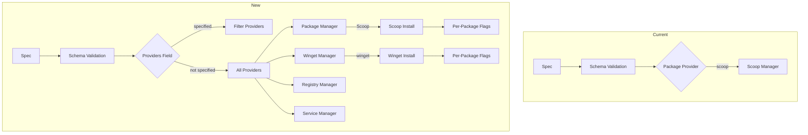

# Plan: Provider Restriction and Winget Support

## Overview

This plan outlines two major features:
1. **Provider restriction field** - Allow users to specify which providers to manage in a spec
2. **Winget support** - Add Windows Package Manager (winget) as a package provider with per-package custom installation flags

---

## Feature 1: Provider Restriction Field

### Goal
Allow users to specify which providers should be managed in a spec file. If not provided or empty, all providers are managed (current behavior).

### Specification Change

Add new field to spec schema:

```powershell
@{
    Name = "example"
    Providers = @("Package", "Service")  # Only manage Package and Service
    Package = @{ ... }
    Service = @{ ... }
}
```

| Field | Type | Required | Default | Description |
|-------|------|----------|---------|-------------|
| `Providers` | array | No | All providers | List of provider names to manage |

### Implementation Steps

#### 1.1 Update Schema (`winspec/schema.psm1`)
- Add `Providers` field to `$Script:SpecSchema`
- Validate that all specified providers exist

#### 1.2 Update State Module (`winspec/state.psm1`)
- Modify `Resolve-ProviderList` to respect spec-defined providers
- The function currently accepts CLI parameter; need to also check spec content

#### 1.3 Update Pull/Push Commands
- Pass spec-defined providers to `Get-SystemState` and `Compare-SystemState`

#### 1.4 Update Documentation (`docs/spec.md`)
- Document the new `Providers` field
- Provide examples

---

## Feature 2: Winget Support + Rename Package to Scoop

### Goal
- Rename existing `package.psm1` to `scoop.psm1`
- Add Windows Package Manager (winget) as a new provider

### Architecture Decision

**Chosen**: Separate providers - `Scoop` and `Winget` as distinct providers

### Specification Format (Scoop)

```powershell
@{
    Scoop = @{
        Installed = @("git", "neovim")
        Buckets = @("main", "extras")
    }
}
```

### Specification Format (Winget)

```powershell
@{
    Winget = @{
        Installed = @("Git.Git", "Microsoft.NodeJS")
        # Or with flags:
        # Installed = @(
        #     @{ Name = "Git.Git"; Flags = "--scope machine" }
        #     @{ Name = "Microsoft.NodeJS"; Flags = "--accept-package-agreements" }
        # )
    }
}
```

### Implementation Steps

#### 2.1 Rename Package to Scoop

Rename existing manager:
- `winspec/managers/package.psm1` → `winspec/managers/scoop.psm1`

Update internal references:
- Function names: `Set-PackageState` → `Set-ScoopState`, etc.
- Provider name in `Get-ProviderInfo`: `"Package"` → `"Scoop"`

Functions to implement:

| Function | Description |
|----------|-------------|
| `Get-ProviderInfo` | Returns provider metadata |
| `Test-WingetInstalled` | Checks if winget is available |
| `Get-WingetExport` | Gets current winget state via `winget export` |
| `Get-InstalledPackages` | Gets list of installed packages |
| `Test-WingetState` | Tests if desired packages are installed |
| `Set-WingetState` | Installs missing packages |
| `Export-WingetState` | Exports state for pull command |
| `Compare-WingetState` | Compares current vs desired state |

#### 2.2 Update Schema for Scoop and Winget

Replace `Package` with `Scoop` in schema, add `Winget`:

The current `Package` provider detects Scoop. Need to:
- Keep `Package` for Scoop-only
- Add `Winget` as separate provider
- Users explicitly choose which to use

#### 2.3 Handle Per-Package Flags

Support both formats:

```powershell
# Simple format (existing)
Package = @{ Installed = @("git", "nodejs") }

# Extended format with flags (new)
Winget = @{
    Installed = @(
        @{ Name = "Git.Git"; Flags = "--scope machine" }
        "Microsoft.NodeJS"  # String still works, no flags
    )
}
```

#### 2.4 Update Schema

Add `Winget` to spec schema:

```powershell
$Script:SpecSchema = @{
    # ... existing fields
    Winget = @{ Type = "hashtable"; Required = $false }
}
```

#### 2.5 Add Tests (`winspec/tests/winget.Tests.ps1`)
- Test provider info
- Test state detection
- Test installation with flags
- Test export/import

#### 2.6 Update Documentation

---

## Feature 3: Per-Package Installation Flags

### Goal
Allow users to specify custom installation flags per package for both Scoop and Winget.

### Implementation

#### 3.1 Update Package Manager (`winspec/managers/package.psm1`)

Modify `Set-PackageState` to handle extended package format:

```powershell
foreach ($package in $Desired.Installed) {
    $pkgName = $package
    $pkgFlags = ""
    
    # Handle extended format
    if ($package -is [hashtable]) {
        $pkgName = $package.Name
        $pkgFlags = $package.Flags
    }
    
    # Use $pkgFlags in installation command
    if ($pkgFlags) {
        Invoke-ScoopCommand -Command "install" -Arguments "$pkgFlags $pkgName"
    }
    else {
        Invoke-ScoopCommand -Command "install" -Arguments $pkgName
    }
}
```

Same pattern for `Test-PackageState` and `Export-PackageState`.

#### 3.2 Update Schema Validation

Allow both string and hashtable in `Installed` array:

```powershell
if ($Config.Package) {
    if ($Config.Package.Installed) {
        foreach ($item in $Config.Package.Installed) {
            if ($item -is [hashtable] -and -not $item.Name) {
                $errors += "Package.Installed hashtable must have 'Name' field"
            }
        }
    }
}
```

---

## Summary of Files to Modify

| File | Changes |
|------|---------|
| `winspec/schema.psm1` | Add `Providers`, `Winget` fields |
| `winspec/state.psm1` | Respect spec-defined providers |
| `winspec/managers/package.psm1` | Rename to `scoop.psm1` |
| `winspec/managers/winget.psm1` | **New file** - Winget provider |
| `docs/spec.md` | Document new features |

## Summary of New Files

| File | Description |
|------|-------------|
| `winspec/managers/winget.psm1` | Winget provider module |
| `winspec/tests/winget.Tests.ps1` | Winget provider tests |

---

## Mermaid Diagram: Current vs New Architecture



---

## Acceptance Criteria

1. **Provider Restriction**
   - [ ] Spec with `Providers = @("Scoop")` only manages Scoop provider
   - [ ] Spec without `Providers` field manages all providers
   - [ ] Invalid provider names show validation error

2. **Scoop Rename**
   - [ ] `package.psm1` renamed to `scoop.psm1`
   - [ ] Provider name is now "Scoop" in metadata
   - [ ] Existing specs with `Package` still work or migration needed

3. **Winget Support**
   - [ ] `winget export` captures installed packages
   - [ ] Push installs missing winget packages
   - [ ] Pull exports winget state to config

4. **Per-Package Flags**
   - [ ] `Installed = @("git")` works as before
   - [ ] `Installed = @({Name="git"; Flags="--global"})` applies flags
   - [ ] Export preserves flags in extended format
