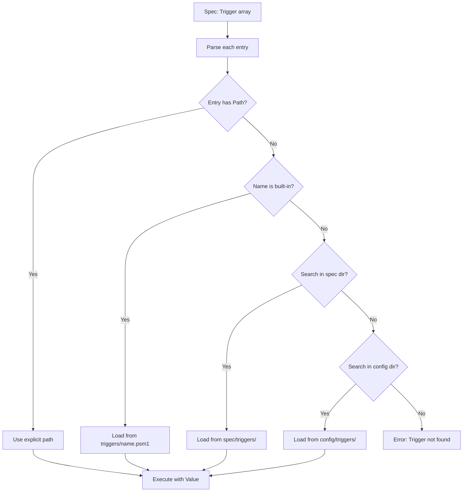

# WinSpec Registry & Trigger Refactor Plan

## Overview

This plan outlines the refactoring of WinSpec's registry maps and trigger system:

1. Registry maps remain in project (no custom registry maps)
2. Rename `providers/` to `managers/` for declarative providers
3. Move all triggers to `triggers/` directory
4. Users can disable default project triggers
5. Configuration location resolution for custom triggers

---

## Problem Analysis: Logic Inconsistency

### Issue: `Get-ProviderMetadata` Function Conflict

**Location:** [`winspec/schema.psm1`](winspec/schema.psm1:118) lines 118-141

**The Problem:**
The [`Get-ProviderMetadata`](winspec/schema.psm1:118) function in schema.psm1 contains hardcoded provider lists and checks against them:

```powershell
$declarativeProviders = @("Registry", "Package", "Service", "Feature")
$triggerProviders = @("Activation", "Debloat", "Office")
```

This creates a **logic inconsistency** with:

1. **The Specification ([`docs/spec.md`](docs/spec.md:183))**: States that providers should export their own `Get-ProviderMetadata` function defining their type declaratively.

2. **The Discovery Mechanism ([`winspec/core.psm1`](winspec/core.psm1:268))**: The [`Get-DiscoveredProviders`](winspec/core.psm1:268) function dynamically discovers providers by:
   - Scanning the managers/triggers directories
   - Importing each provider module
   - Calling `Get-ProviderInfo` to get provider info

3. **The Provider Modules**: Individual providers (like [`winspec/managers/registry.psm1`](winspec/managers/registry.psm1)) export their own `Get-ProviderInfo` function that returns their metadata.

**The Conflict:**
- Provider modules export `Get-ProviderInfo` (the actual implementation)
- `schema.psm1` exports a hardcoded `Get-ProviderMetadata` that overrides the discovery
- When `Get-DiscoveredProviders` runs, it may resolve to the wrong function due to naming conflicts
- Hardcoded lists in schema.psm1 require code changes when adding new providers
- Violates the open/closed principle - new providers require modifying schema.psm1

**Resolution:**
- Provider modules already correctly export `Get-ProviderInfo` 
- Remove the hardcoded `Get-ProviderMetadata` from `schema.psm1`
- Update `Get-DiscoveredProviders` to explicitly call `Get-ProviderInfo` from the provider module's scope
- Use `& $importedModule { Get-ProviderInfo }` to ensure correct scope resolution

---

## Part 1: Registry Map Refactoring

### Current State
- Registry maps are hardcoded in `winspec/schema.psm1` as `$Script:RegistryMaps`
- Contains 4 categories: Clipboard, Explorer, Theme, Desktop

### Target State
- Registry maps moved to `winspec/registry-maps.ps1`
- **No custom registry maps** - only project-defined maps
- Schema module imports maps from external file

### Implementation

#### 1.1 Create `winspec/registry-maps.ps1`
```powershell
# registry-maps.ps1 - Registry configuration maps
# Project-defined registry categories and properties only

$Script:RegistryMaps = @{
    Clipboard = @{ ... }
    Explorer = @{ ... }
    Theme = @{ ... }
    Desktop = @{ ... }
}

function Get-RegistryMaps {
    return $Script:RegistryMaps
}

Export-ModuleMember -Function Get-RegistryMaps
```

#### 1.2 Update `winspec/schema.psm1`
- Import `registry-maps.ps1` instead of defining inline
- Remove `$Script:RegistryMaps` definition
- Keep `Get-RegistryMap` function (delegate to imported module)

---

## Part 2: Registry Documentation (`docs/registry.md`)

### Content Structure
1. Overview of registry provider
2. All available categories with properties
3. Property details: name, type, values, registry path
4. Examples for each category

### Categories to Document
| Category | Description |
|----------|-------------|
| Clipboard | Clipboard history settings |
| Explorer | File Explorer behavior |
| Theme | Windows theme (light/dark) |
| Desktop | Desktop behavior settings |

---

## Part 3: Directory Restructuring

### Current Structure
```
winspec/
├── providers/
│   ├── registry.psm1      # Declarative
│   ├── package.psm1       # Declarative
│   ├── service.psm1      # Declarative
│   ├── feature.psm1      # Declarative
│   ├── activation.psm1   # Trigger
│   ├── debloat.psm1      # Trigger
│   └── office.psm1       # Trigger
```

### Target Structure
```
winspec/
├── managers/              # Declarative providers only
│   ├── registry.psm1
│   ├── package.psm1
│   ├── service.psm1
│   └── feature.psm1
│
├── triggers/              # Built-in project triggers
│   ├── activation.psm1
│   ├── debloat.psm1
│   └── office.psm1
```

### Implementation

1. Rename `winspec/providers/` to `winspec/managers/`
2. Move trigger providers from `providers/` to `triggers/`
3. Update `core.psm1` to reference new directories

---

## Part 4: Trigger Configuration Format

### New Format: Array of Hashtables

Instead of `$true` or `@{ Option = "value" }`, triggers are specified as an array of hashtables:

```powershell
Trigger = @(
    # Built-in trigger (no value)
    @{ Name = "Activation" }
    
    # Built-in trigger with value
    @{ Name = "Debloat"; Value = "silent" }
    
    # Custom trigger - path specified
    @{ Name = "my-trigger"; Path = ".\triggers\my-trigger.ps1" }
    
    # Disable a trigger
    @{ Name = "Office"; Enabled = $false }
)
```

### Field Definitions

| Field | Type | Required | Description |
|-------|------|----------|-------------|
| `Name` | string | Yes | Trigger name (built-in or custom) |
| `Value` | any | No | Option/value to pass to trigger |
| `Path` | string | No | Path to custom trigger script (relative to spec or config) |
| `Enabled` | bool | No | Enable/disable trigger (default: $true) |

### Examples

```powershell
# Enable built-in trigger
Trigger = @(
    @{ Name = "Activation" }
)

# Built-in trigger with option
Trigger = @(
    @{ Name = "Debloat"; Value = "silent" }
)

# Custom trigger with path (relative to spec)
Trigger = @(
    @{ Name = "my-custom"; Path = ".\scripts\my-trigger.ps1" }
)

# Disable a built-in trigger
Trigger = @(
    @{ Name = "Office"; Enabled = $false }
)

# Multiple triggers
Trigger = @(
    @{ Name = "Activation" }
    @{ Name = "Debloat"; Value = "silent" }
    @{ Name = "backup"; Path = ".\triggers\backup.ps1"; Value = "C:\backup" }
)
```

---

## Part 5: Built-in Trigger Management

### Disable Default Triggers

Users can disable project triggers by setting `Enabled = $false`:

```powershell
# specs/my-spec.ps1
@{
    Name = "my-spec"
    
    # Disable specific triggers
    Trigger = @(
        @{ Name = "Activation"; Enabled = $false }
        @{ Name = "Debloat"; Enabled = $false }
    )
}
```

### Default Behavior

- If `Trigger` key is not specified: use built-in triggers
- If `Trigger` is empty array `@()`: no triggers executed
- If `Trigger` contains specific entries: only those triggers executed

---

## Part 6: Custom Trigger System

### Configuration Location Resolution

**Priority Order (highest to lowest):**

1. **Command line argument** (`-ConfigPath`)
2. **Environment variable** (`$env:WINSPEC_CONFIG`)
3. **`.config/winspec/` directory** in user home
4. **`.winspec.ps1`** in current working directory (hardcoded default)

### Trigger Resolution Order

When a trigger is referenced in spec:

1. Check if trigger has explicit `Path` - use that path
2. Check if trigger is a built-in project trigger (`triggers/<name>.psm1`)
3. Check for file in spec directory: `<spec-dir>/<name>.ps1`
4. Check for file in config location: `<config-dir>/triggers/<name>.ps1`

### Custom Trigger Script Format

```powershell
# Custom trigger: triggers/my-trigger.ps1
param(
    [Parameter(Mandatory = $false)]
    $Value = $true,
    
    [switch]$WhatIf
)

# Custom trigger logic
if ($WhatIf) {
    Write-Host "Would execute custom trigger with value: $Value"
    return @{ Status = "DryRun" }
}

# Actual execution
# ... do something ...

return @{ Status = "Success"; Message = "Custom trigger executed" }
```

---

## Part 7: Core Engine Changes

### Fix: Remove `Get-ProviderMetadata` from schema.psm1

**In `winspec/schema.psm1`:**
- **Remove** the hardcoded `Get-ProviderMetadata` function (lines 118-141)
- **Remove** `Get-ProviderMetadata` from `Export-ModuleMember`
- Provider modules already export their own `Get-ProviderInfo` function
- The discovery mechanism in `core.psm1` should use the provider's own function

**Rationale:**
- Each provider module (Registry, Package, Service, Feature, Activation, Debloat, Office) already defines its own `Get-ProviderInfo` function
- These functions return the correct metadata for that specific provider
- The centralized version in schema.psm1 with hardcoded lists duplicates and overrides this functionality
- Removing it allows the discovery mechanism to work as designed per the specification
- Enables adding new providers without modifying core code (open/closed principle)

### New Functions

```powershell
# Configuration resolution
function Resolve-ConfigLocation {
    param(
        [string]$ConfigPath,
        [string]$SpecPath
    )
    # Return config location based on priority
}

# Trigger discovery
function Find-TriggerScript {
    param(
        [string]$Name,
        [string]$Path,        # Explicit path if provided
        [string]$SpecPath,
        [string]$ConfigPath
    )
    # Search for trigger script in order:
    # 1. Explicit path
    # 2. Built-in: triggers/<Name>.psm1
    # 3. Relative to spec: <SpecPath>/<Name>.ps1
    # 4. Config triggers: <ConfigPath>/triggers/<Name>.ps1
}

# Custom trigger execution
function Invoke-CustomTrigger {
    param(
        [string]$ScriptPath,
        $Value,
        [switch]$WhatIf
    )
}
```

### Updated `Invoke-Triggers`
- Parse new array format with `Name`, `Value`, `Path`, `Enabled` fields
- Load triggers from `winspec/triggers/` directory
- Support trigger disable via `Enabled = $false`
- Load custom triggers from spec-relative or config-relative paths

### Updated `Get-DiscoveredProviders`
- Changed to call the provider's own `Get-ProviderInfo` function (not `Get-ProviderMetadata`)
- Uses `& $importedModule { Get-ProviderInfo }` to ensure correct module scope resolution
- Falls back to `Get-Command -Module $file.BaseName -Name "Get-ProviderInfo"` if module scope fails
- This ensures each provider's metadata is read from its own module, not from hardcoded lists

---

## Part 8: File Changes Summary

| File | Action | Description |
|------|--------|-------------|
| `winspec/registry-maps.ps1` | Create | External registry map data |
| `winspec/schema.psm1` | Modify | Import from registry-maps.ps1; **Remove hardcoded `Get-ProviderMetadata` function** |
| `winspec/providers/` | Rename | Rename to `managers/` |
| `winspec/triggers/` | Create | Move triggers here |
| `winspec/core.psm1` | Modify | Update paths + add custom trigger loading + **fix discovery to use `Get-ProviderInfo`** |
| `docs/registry.md` | Create | Registry provider documentation |
| Provider modules | Verified | All already export `Get-ProviderInfo` correctly |

---

## Part 9: Mermaid Diagrams

### Trigger Configuration Flow


---

## Execution Order (Completed)

1. ✅ Create `winspec/registry-maps.ps1` - separate data file
2. ✅ Update `winspec/schema.psm1` - import external maps; **remove hardcoded `Get-ProviderMetadata` function**; update `Export-ModuleMember`
3. Rename `winspec/providers/` to `winspec/managers/` - pending directory restructure
4. Move triggers to `winspec/triggers/` - pending directory restructure
5. Write `docs/registry.md` - pending documentation
6. ✅ Update `winspec/core.psm1` - **fix `Get-DiscoveredProviders` to use `Get-ProviderInfo` from provider module scope**
7. Update `docs/spec.md` - pending documentation
8. ✅ **Verified** - all provider modules already export `Get-ProviderInfo` correctly
9. **Test** - provider discovery works with dynamic metadata - pending test execution

### Summary of Code Changes Made

**`winspec/schema.psm1`:**
- Removed hardcoded `Get-ProviderMetadata` function (lines 118-141)
- Removed `Get-ProviderMetadata` from `Export-ModuleMember`
- Module now only exports `Get-SpecSchema` and `Test-SpecSchema`

**`winspec/core.psm1`:**
- Updated `Get-DiscoveredProviders` to call `Get-ProviderInfo` instead of `Get-ProviderMetadata`
- Uses explicit module scope: `& $importedModule { Get-ProviderInfo }`
- Added fallback using `Get-Command` for robustness
- This ensures each provider's metadata is read from its own module

**Result:** Provider discovery now works dynamically without hardcoded lists, following the open/closed principle.
