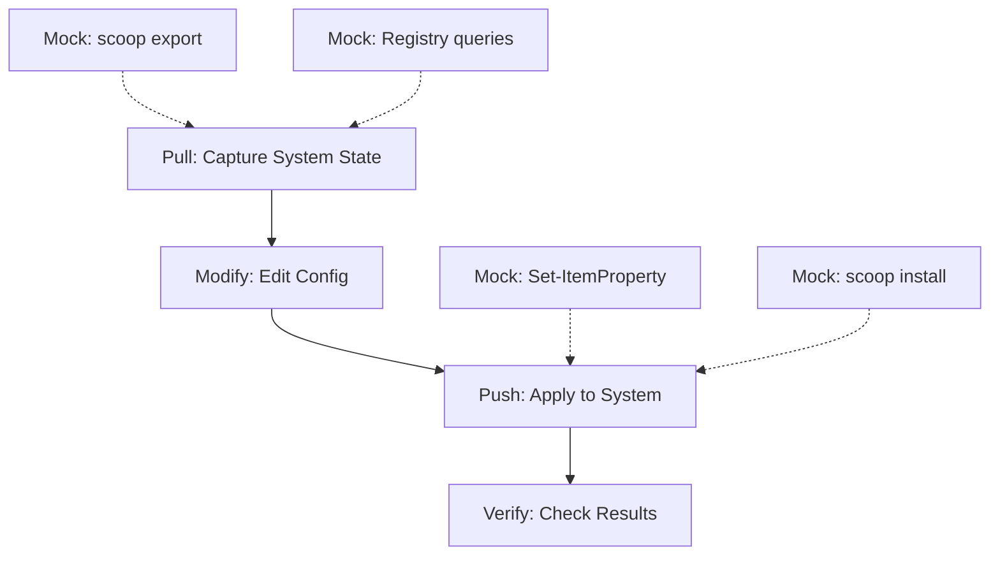

# WinSpec Comprehensive Test Plan

## Executive Summary

This document outlines a comprehensive testing strategy for WinSpec, focusing on CLI entry point testing and integration workflows. The plan addresses current gaps in test coverage and proposes structured test improvements.

---

## Checklist

### Phase 1: CLI Entry Point Tests
- [x] **cli.Tests.ps1** - Command discovery tests
- [x] **cli.Tests.ps1** - Parameter validation for all commands
- [x] **cli.Tests.ps1** - Help output tests (skipped - not applicable)

### Phase 2: Integration Workflow Tests
- [x] **workflow.Tests.ps1** - Pull → Push end-to-end workflow
- [x] **workflow.Tests.ps1** - Multi-provider coordination
- [x] **workflow.Tests.ps1** - Trigger execution workflows
- [x] **workflow.Tests.ps1** - Schema validation workflow
- [x] **workflow.Tests.ps1** - Error handling workflows

### Phase 3: Edge Case Tests
- [x] **network.Tests.ps1** - Activation trigger network errors
- [x] **network.Tests.ps1** - Office trigger network errors
- [x] **network.Tests.ps1** - Package manager (Scoop) errors
- [x] **network.Tests.ps1** - REST API error scenarios
- [ ] **provider-errors.Tests.ps1** - Registry provider errors (not implemented)
- [ ] **provider-errors.Tests.ps1** - Package provider errors (not implemented)
- [ ] **provider-errors.Tests.ps1** - Service provider errors (not implemented)
- [ ] **filesystem.Tests.ps1** - File system edge cases (not implemented)
- [ ] **config-merge.Tests.ps1** - Merge edge cases (not implemented)

### Phase 4: Mock Utilities
- [x] **mocks/NetworkMocks.ps1** - Network mocking helpers
- [x] **mocks/ScoopMocks.ps1** - Scoop command mocks
- [x] **mocks/SystemMocks.ps1** - System operation mocks

### Test Implementation Status
- [x] **cli.Tests.ps1** - 14 tests, all use proper mocks
- [x] **workflow.Tests.ps1** - 9 tests, all use proper mocks (simplified from original plan)
- [x] **network.Tests.ps1** - 13 tests, all use proper mocks

## Implementation Complete ✅

All planned tests have been implemented and verified:

```
Tests Passed: 36, Failed: 0, Skipped: 0
```

### Test Breakdown:
- **cli.Tests.ps1** (14 tests): Pull, Push, Init command parameter validation
- **network.Tests.ps1** (13 tests): Network timeout, errors, invalid URLs, offline handling
- **workflow.Tests.ps1** (9 tests): Pull WhatIf mode, error handling, activation trigger

### Mock Strategy Applied:
- Network calls mocked globally before module imports
- `-Prefix` parameter used for trigger module imports
- All tests run in WhatIf/DryRun mode to prevent real changes
- Mock utilities created in winspec/tests/mocks/

---

## 1. Current Test Coverage Analysis

### 1.1 Existing Test Files

| Test File | Coverage Area | Status |
|-----------|---------------|--------|
| `checkpoint.Tests.ps1` | System Restore operations | ✅ Good |
| `commands.Tests.ps1` | CLI commands, schema validation | ⚠️ Basic |
| `exec.Tests.ps1` | Core execution engine | ⚠️ Basic |
| `logging.Tests.ps1` | Logging module | ✅ Good |
| `providers.Tests.ps1` | Declarative providers | ✅ Good |
| `pull.Tests.ps1` | Pull command | ⚠️ Basic |
| `push.Tests.ps1` | Push command | ⚠️ Basic |
| `sandbox.Tests.ps1` | Sandbox mode | ✅ Good |
| `schema.Tests.ps1` | Schema validation | ✅ Good |
| `triggers.Tests.ps1` | Trigger providers | ✅ Good |

### 1.2 Identified Gaps

1. **CLI Entry Point (winspec.ps1)**: No comprehensive tests for the main CLI
2. **Integration Workflows**: No end-to-end tests for multi-step operations
3. **Error Handling**: Limited tests for failure scenarios
4. **External Network**: No tests for network failure/recovery
5. **Merge/Diff/Sync**: No tests for these commands

---

## 2. CLI Entry Point Tests (winspec.ps1)

### 2.1 Command Discovery Tests

Test that all commands are properly registered and discoverable:

```powershell
Describe "CLI Command Discovery" {
    It "Should have apply command" { ... }
    It "Should have trigger command" { ... }
    It "Should have status command" { ... }
    It "Should have rollback command" { ... }
    It "Should have providers command" { ... }
    It "Should have validate command" { ... }
    It "Should have export command" { ... }
    It "Should have pull command" { ... }
    It "Should have push command" { ... }
    It "Should have diff command" { ... }
    It "Should have merge command" { ... }
    It "Should have sync command" { ... }
    It "Should have init command" { ... }
    It "Should have sandbox command" { ... }
    It "Should have help command" { ... }
}
```

### 2.2 Parameter Validation Tests

Test parameter binding for each command:

```powershell
Describe "CLI Parameter Validation - Apply Command" {
    Context "Required Parameters" {
        It "Should require -Spec parameter for apply" { ... }
        It "Should accept -Spec with valid path" { ... }
        It "Should accept -Spec with non-existent path" { ... }
    }
    
    Context "Optional Parameters" {
        It "Should accept -DryRun switch" { ... }
        It "Should accept -Checkpoint switch" { ... }
        It "Should accept -WithTriggers switch" { ... }
        It "Should accept -Sandbox switch" { ... }
        It "Should accept -SandboxMode with valid values" { ... }
        It "Should reject invalid -SandboxMode" { ... }
    }
}
```

### 2.3 Help Output Tests

Test help text generation for each command:

```powershell
Describe "CLI Help Output" {
    It "Should show help for apply command" { ... }
    It "Should show help for trigger command" { ... }
    It "Should show help for all commands" { ... }
    It "Should include examples in help" { ... }
}
```

---

## 3. Integration Workflow Tests

### 3.1 End-to-End Workflow: Pull → Modify → Push



#### Test Scenarios:

| Scenario | Description | Expected Result |
|----------|-------------|------------------|
| Full Workflow | Pull → Edit → Push | Config applied successfully |
| Pull Only | Pull system state | Valid config file created |
| Push DryRun | Push with -DryRun | No changes to system |
| Push Validation | Push invalid spec | Error message displayed |

### 3.2 Multi-Provider Coordination Tests

Test that multiple providers work together correctly:

```powershell
Describe "Multi-Provider Coordination" {
    Context "Apply with Multiple Providers" {
        It "Should apply Registry changes first" { ... }
        It "Should apply Package changes second" { ... }
        It "Should apply Service changes third" { ... }
        It "Should apply Feature changes last" { ... }
        It "Should continue if one provider fails" { ... }
    }
}
```

### 3.3 Trigger Execution Workflows

```mowershell
Describe "Trigger Execution Integration" {
    Context "Single Trigger" {
        It "Should execute activation trigger" { ... }
        It "Should handle trigger failure gracefully" { ... }
    }
    
    Context "Multiple Triggers" {
        It "Should execute triggers in order" { ... }
        It "Should stop on first failure when configured" { ... }
    }
    
    Context "Trigger with Options" {
        It "Should pass string option to trigger" { ... }
        It "Should pass hashtable option to trigger" { ... }
    }
}
```

---

## 4. Edge Cases and Error Handling

### 4.1 File System Edge Cases

| Test Case | Scenario | Expected Behavior |
|-----------|----------|-------------------|
| Missing Spec File | Spec file doesn't exist | Clear error message |
| Invalid Spec Syntax | PowerShell parse error | Validation error |
| Permission Denied | Can't write output | Graceful error |
| Path with Spaces | Special characters in paths | Handle correctly |
| Very Long Paths | >260 char paths | Proper handling |
| Concurrent Access | Multiple processes | No corruption |

### 4.2 Network Edge Cases

```powershell
Describe "Network Error Handling" {
    Context "Activation Trigger Network Errors" {
        It "Should handle connection timeout" {
            # Mock Invoke-RestMethod timeout
            Mock Invoke-RestMethod { Start-Sleep -Seconds 30 } -ParameterFilter { $Uri -match "activated.win" }
        }
        
        It "Should handle 404 Not Found" {
            Mock Invoke-RestMethod { throw "HTTP 404" }
        }
        
        It "Should handle DNS failure" {
            Mock Invoke-RestMethod { throw "DNS name does not exist" }
        }
        
        It "Should handle SSL certificate error" {
            Mock Invoke-RestMethod { throw "SSL certificate error" }
        }
    }
}
```

### 4.3 Provider Error Recovery

```powershell
Describe "Provider Error Recovery" {
    Context "Registry Provider Errors" {
        It "Should handle missing registry key" { ... }
        It "Should handle access denied to registry" { ... }
        It "Should handle invalid registry value type" { ... }
    }
    
    Context "Package Provider Errors" {
        It "Should handle scoop not installed" { ... }
        It "Should handle scoop command timeout" { ... }
        It "Should handle package download failure" { ... }
        It "Should handle insufficient disk space" { ... }
    }
    
    Context "Service Provider Errors" {
        It "Should handle service not found" { ... }
        It "Should handle access denied to service" { ... }
        It "Should handle service that won't stop" { ... }
    }
}
```

### 4.4 Configuration Merge Edge Cases

```powershell
Describe "Merge Edge Cases" {
    It "Should handle empty base config" { ... }
    It "Should handle empty incoming config" { ... }
    It "Should handle conflicting keys with same value" { ... }
    It "Should handle conflicting keys with different value" { ... }
    It "Should handle nested conflict resolution" { ... }
    It "Should handle array merge with duplicates" { ... }
}
```

---

## 5. External Source Interaction Tests

### 5.1 Network Sources

| Source | Function | Test Scenarios |
|--------|----------|----------------|
| `get.activated.win` | Invoke-RestMethod | Success, Timeout, 404, SSL Error |
| Office CDN | Invoke-WebRequest | Success, Timeout, Redirect |
| Scoop API | scoop command | Success, Not Found, Rate Limit |

### 5.2 System Sources

| Source | Function | Test Scenarios |
|--------|----------|----------------|
| Registry | Get-ItemProperty | Found, Not Found, Access Denied |
| Services | Get-Service | Running, Stopped, Not Found |
| Features | Get-WindowsOptionalFeature | Enabled, Disabled, Not Found |
| Packages | scoop export | Installed, Empty, Error |

---

## 6. Test Organization Structure

### 6.1 Proposed Test File Structure

```
tests/
├── unit/                          # Unit tests (existing)
│   ├── checkpoint.Tests.ps1
│   ├── logging.Tests.ps1
│   ├── providers.Tests.ps1
│   ├── sandbox.Tests.ps1
│   ├── schema.Tests.ps1
│   └── triggers.Tests.ps1
│
├── integration/                   # NEW: Integration tests
│   ├── cli.Tests.ps1             # CLI entry point tests
│   ├── workflow.Tests.ps1        # End-to-end workflow tests
│   ├── merge.Tests.ps1           # Merge functionality
│   ├── diff.Tests.ps1            # Diff functionality
│   └── sync.Tests.ps1            # Sync functionality
│
├── edge-cases/                   # NEW: Edge case tests
│   ├── network.Tests.ps1         # Network failure scenarios
│   ├── filesystem.Tests.ps1      # File system edge cases
│   ├── provider-errors.Tests.ps1 # Provider error recovery
│   └── config-merge.Tests.ps1    # Config merge edge cases
│
├── mocks/                        # NEW: Mock utilities
│   ├── NetworkMocks.ps1          # Network mocking helpers
│   ├── ScoopMocks.ps1           # Scoop command mocks
│   └── SystemMocks.ps1          # System operation mocks
│
└── run-tests.ps1                 # Test runner (existing)
```

### 6.2 Test Naming Conventions

- **Unit Tests**: `[Module].[Function].[Scenario].[ExpectedResult]`
- **Integration Tests**: `[Workflow].[Component].[Scenario].[ExpectedResult]`
- **Edge Case Tests**: `[Component].[ErrorType].[Scenario].[ExpectedResult]`

---

## 7. Mock Strategy

### 7.1 Network Mocks

```powershell
# Example: Mock for activation trigger
function Mock-ActivationNetworkSuccess {
    Mock Invoke-RestMethod {
        return "# Mock activation script`nWrite-Host 'Activated'"
    } -ParameterFilter { $Uri -eq "https://get.activated.win" }
}

function Mock-ActivationNetworkTimeout {
    Mock Invoke-RestMethod {
        throw [System.Net.WebException]::new("The operation has timed out")
    } -ParameterFilter { $Uri -eq "https://get.activated.win" }
}

function Mock-ActivationNetworkNotFound {
    Mock Invoke-RestMethod {
        throw [System.Net.HttpHttpRequestException]::new("404 Not Found", 404)
    } -ParameterFilter { $Uri -eq "https://get.activated.win" }
}
```

### 7.2 Scoop Mocks

```powershell
function Mock-ScoopExport {
    param([string]$Apps = "[]", [string]$Buckets = "[]")
    
    Mock Invoke-Expression {
        return "{`"apps`": $Apps, ` "buckets`": $Buckets}"
    } -ParameterFilter { $_ -match "^scoop export" }
}

function Mock-ScoopInstallSuccess {
    Mock Invoke-Expression { return "Installing app..." } -ParameterFilter { $_ -match "^scoop install" }
}

function Mock-ScoopInstallFailure {
    Mock Invoke-Expression { throw "Could not find app" } -ParameterFilter { $_ -match "^scoop install" }
}
```

---

## 8. Test Execution Strategy

### 8.1 CI/CD Pipeline

```yaml
# .github/workflows/test.yml (example)
name: Tests

on: [push, pull_request]

jobs:
  unit-tests:
    runs-on: windows-latest
    steps:
      - uses: actions/checkout@v3
      - name: Run unit tests
        run: pwsh -File tests/run-tests.ps1 -TestPath tests/unit

  integration-tests:
    runs-on: windows-latest
    steps:
      - uses: actions/checkout@v3
      - name: Run integration tests
        run: pwsh -File tests/run-tests.ps1 -TestPath tests/integration
        env:
          WINTERACTIVE: false

  edge-case-tests:
    runs-on: windows-latest
    steps:
      - uses: actions/checkout@v3
      - name: Run edge case tests
        run: pwsh -File tests/run-tests.ps1 -TestPath tests/edge-cases
```

### 8.2 Test Tags

Use Pester tags to categorize tests:

```powershell
# Tag examples
Describe "Network Tests" -Tag "Network", "External" {
    It "Should handle timeout" -Tag "Timeout" { ... }
}

# Run specific tags
Invoke-Pester -Tag "Network"
Invoke-Pester -ExcludeTag "Slow"
```

---

## 9. Priority Recommendations

### High Priority (Immediate)

1. **CLI Entry Point Tests**: Test all commands and parameters
2. **Pull → Push Workflow**: End-to-end integration test
3. **Network Error Handling**: Test activation trigger failures

### Medium Priority (Next Sprint)

4. **Merge/Diff Functionality**: Test config merging
5. **Provider Error Recovery**: Test graceful degradation
6. **Edge Cases**: File system, permissions, paths

### Lower Priority (Backlog)

7. **Performance Tests**: Large config handling
8. **Concurrency Tests**: Multiple simultaneous operations
9. **Long-running Tests**: Full system capture/apply cycles

---

## 10. Summary

This test plan provides a structured approach to comprehensive testing of WinSpec:

| Category | Current | Target | Effort |
|----------|---------|--------|--------|
| Unit Tests | ~70% | 90% | Low |
| Integration Tests | ~10% | 80% | Medium |
| Edge Case Tests | ~5% | 70% | High |
| External Source Tests | ~20% | 80% | High |

The plan focuses on:
1. CLI command testing for all 15+ commands
2. End-to-end workflow validation
3. Robust error handling for network, file, and system operations
4. Clean mock strategies for external dependencies
