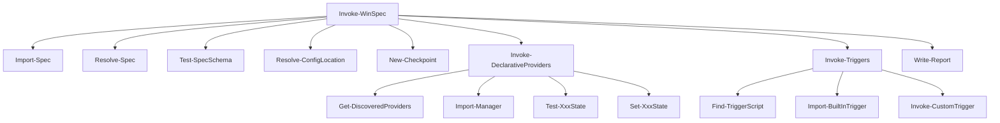

# WinSpec Refactor Plan

## Executive Summary

This document identifies code quality issues, redundancies, and inconsistencies in the WinSpec codebase to improve maintainability, readability, and efficiency.

**Status**: 🔄 In Progress - Issues Being Resolved

---

## Workflow Resolution

The main orchestration workflow is handled by [`Invoke-WinSpec`](winspec/core.psm1:586) in `core.psm1`:

---

## Issue Status Summary

| # | Issue | Status | Location |
|---|-------|--------|----------|
| 1-10 | Original refactor issues | ✅ Fixed | core.psm1 |
| 11 | Unused Get-ProviderDescription | ✅ Fixed | Removed from core.psm1 |
| 12 | Duplicate Import Functions | ✅ Fixed | Consolidated into Import-ModuleSafe |
| 13 | Missing Error Handling in Provider Calls | ✅ Fixed | Added try/catch blocks |
| 14 | Hardcoded Provider Lists | 🔄 Pending | schema.psm1:124 - Low priority |
| 15 | Alias Indirection | ✅ Fixed | Using Get-ProviderMetadata explicitly |
| 16 | Test-Spec is Redundant | ✅ Fixed | Removed, using Test-SpecSchema directly |
| 17 | WhatIf Double-Handling | ✅ Verified | Consistent implementation |
| 18 | No Progress Indication | 🔄 In Progress | core.psm1:Get-SystemStatus |
| 19 | Missing Documentation | ✅ Fixed | Added to key functions |
| 20 | Indentation Inconsistency | ✅ Fixed | Using splatting |
| 21 | Missing Parameter Validation | ✅ Fixed | Added [ValidateNotNull()] |
| 22 | Unstructured Results | 🔄 In Progress | Multiple locations |
| 23 | Script Parameter Assumption | 🔄 In Progress | core.psm1:Invoke-CustomTrigger |
| 24 | No Circular Reference Protection | ✅ Fixed | Added depth limit |
| 25 | Trigger Discovery Outside core.psm1 | ✅ Fixed | Added Get-AllTriggers |

---

## Remaining Issues to Address

### 18. 🔄 No Progress Indication for Long Operations
**Location**: [`Get-SystemStatus`](winspec/core.psm1:658)

**Problem**: System status checks (registry, packages, checkpoints) could take time but provide no progress indication.

**Solution**: Add `Write-Verbose` calls or progress indicators for long-running operations.

---

### 22. 🔄 Results Hashtable Lacks Structure
**Location**: Throughout `Invoke-DeclarativeProviders` and `Invoke-Triggers`

**Problem**: Results hashtables are built ad-hoc with inconsistent keys.

**Solution**: Define a result class or consistent hashtable structure.

---

### 23. 🔄 Invoke-CustomTrigger Parameter Handling Risk
**Location**: [`Invoke-CustomTrigger`](winspec/core.psm1:411)

**Problem**: The function invokes scripts with a specific parameter signature assumption.

**Solution**: Document required script signature.

---

## Design Principles Applied

1. **Single Responsibility**: Each function does one thing well
2. **Fail Fast**: Use early returns to reduce nesting
3. **Consistent Patterns**: Same style for error handling, parameter validation, etc.
4. **Logging Over Output**: Use logging module, not Write-Host
5. **Explicit Over Implicit**: Clear null checks, explicit parameters
6. **Minimal Public API**: Only export functions meant for external use
7. **Defensive Programming**: Validate inputs, handle edge cases
